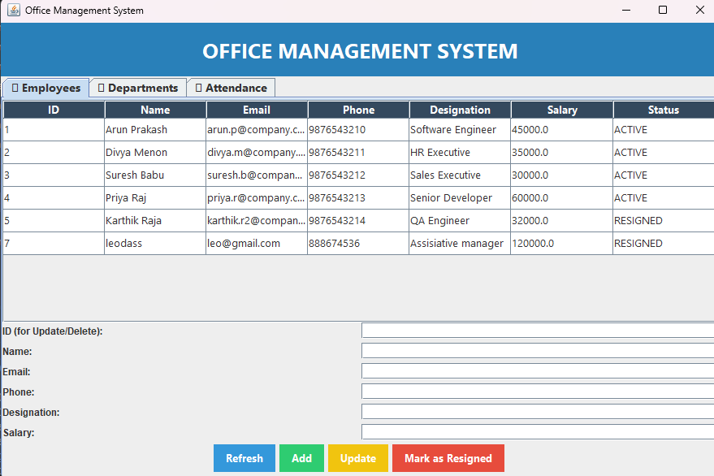
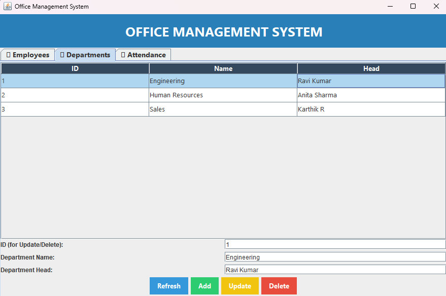
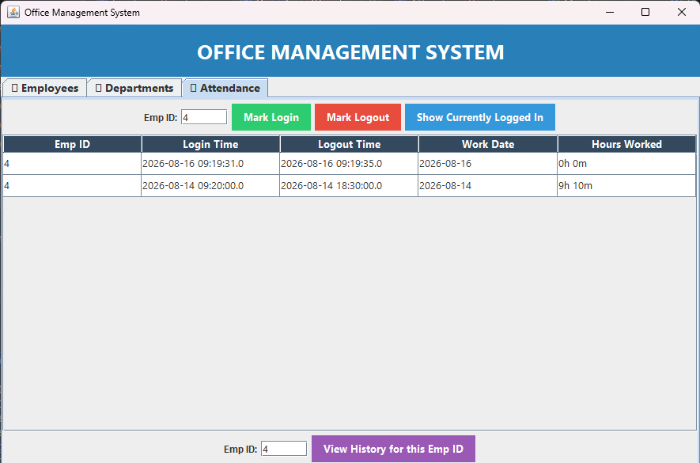

# Office Management System

A Java desktop application for managing employees, departments, and attendance — built with Swing (GUI) and a console interface, backed by MySQL via JDBC.

## Features

- **Employee Management**: Add, update, view, and soft-delete (mark as resigned) employees
- **Department Management**: Full CRUD for departments
- **Attendance Tracking**: Real login/logout style tracking
    - Mark login (one entry per employee per day)
    - Mark logout (updates the same day's record)
    - View who's currently logged in
    - View attendance history with automatic hours-worked calculation
- **Referential Integrity**: Foreign key constraints prevent orphaned attendance records; employees are soft-deleted (status flag) instead of removed, preserving historical data
- **Two interfaces**: Console (menu-driven) and Swing GUI (tabbed)

## Tech Stack

- Java 17+
- MySQL 8
- JDBC (MySQL Connector/J)
- Swing (GUI)

## Architecture

Built using the **DAO (Data Access Object) pattern** for clean separation between business logic and database access.

All database operations use **PreparedStatements** to prevent SQL injection.

## Database Schema

- **Departments**: dept_id, dept_name, dept_head
- **Employees**: emp_id, name, email, phone, designation, salary, date_of_joining, dept_id (FK), status
- **Attendance**: attendance_id, emp_id (FK), login_time, logout_time, work_date

  ## Screenshots

### Employee Management

### Department Management

### Attendance Tracking

## Database Schema

## Setup

1. Clone this repo
2. Create the MySQL database and tables (see below)
3. Copy `config.properties.example`, rename the copy to `config.properties`, and fill in your own MySQL credentials
4. Open in IntelliJ, add MySQL Connector/J to project dependencies
5. Run `Main.java` for console mode, or `MainFrame.java` for GUI mode

## Future Improvements

- Export attendance reports to PDF/Excel
- Charts for attendance/salary analytics
- Login system for the app itself
